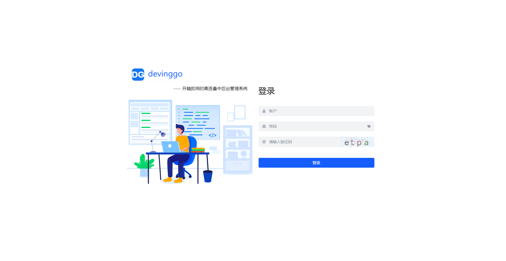
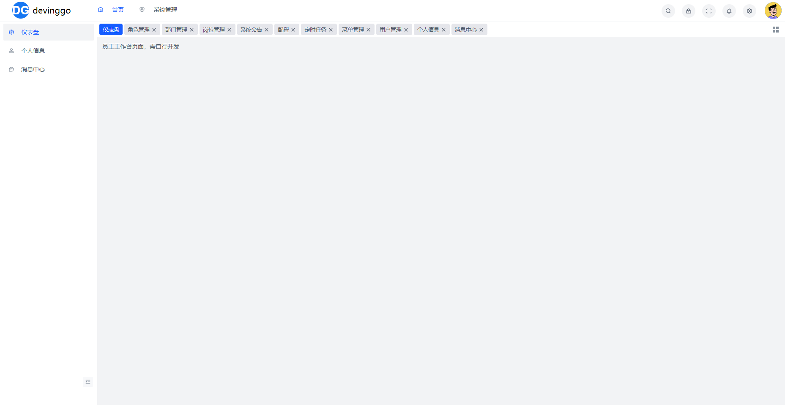
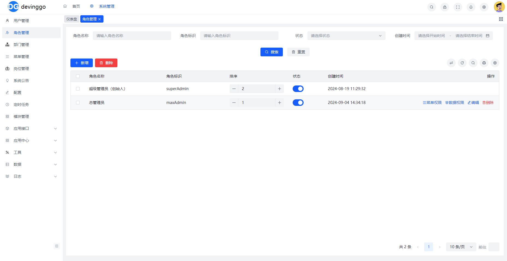
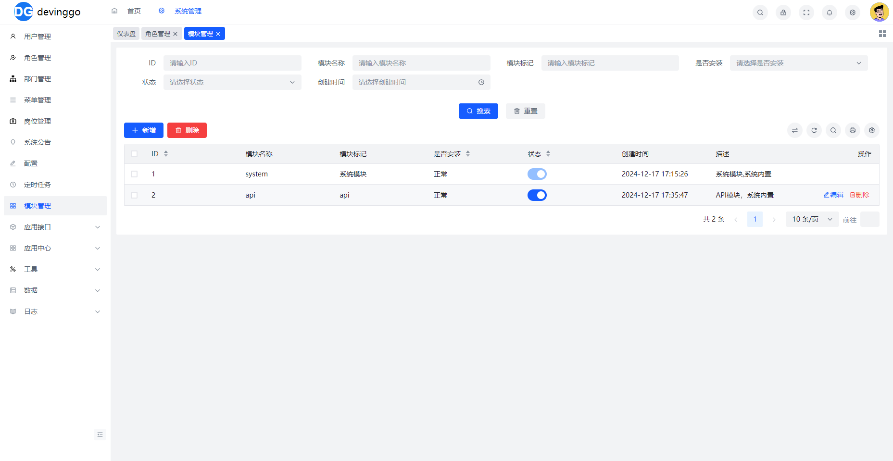

<p align="center">
  
</p>
<p align="center">
 
  
	
	
	
</p>
<p  align="center">
<a href="https://zread.ai/huagelong/devinggo" target="_blank"></a>
</p>

## 简介

`DevingGo` 是一个基于 **GoFrame v2.9** 开发的企业级**后端API服务框架**。项目采用模块化架构设计，内置完善的权限管理、代码生成器、任务调度等企业级功能，专注于提供一个**简洁、高效、安全、可扩展**的后端开发框架。

### 特点

- 🚀 **高性能**: 基于GoFrame框架，充分发挥Go语言的高并发优势
- 🔧 **开箱即用**: 内置完整的后台管理API功能，快速启动项目开发
- 📦 **模块化**: 插件化模块系统，支持模块独立开发和热插拔
- 🛠️ **代码生成**: 强大的代码生成器，一键生成CRUD代码，提升开发效率
- 🔐 **安全可靠**: 完善的权限控制体系，支持RBAC权限模型
- 🌍 **国际化**: 内置多语言支持，轻松实现国际化
- 🐳 **容器化**: 支持Docker一键部署，简化运维流程

### 技术亮点

- **分布式WebSocket**: 完整实现Pusher Protocol v8.3.0，支持分布式部署
- **异步任务队列**: 基于Asynq的分布式任务队列，支持任务重试和监控
- **数据库迁移**: 版本化数据库管理，支持迁移和回滚
- **链路追踪**: 集成OpenTelemetry和Jaeger，轻松实现分布式追踪
- **API文档**: 自动生成OpenAPI文档，支持在线调试

## 演示地址

- **API文档**: https://devinggo-dev.devinghub.com/swagger
- **测试账号**: superAdmin / admin123

## 视频教程
- b站: https://space.bilibili.com/323699697

## 文档

- [文档](https://devinggo.devinghub.com/)
- [zread](https://zread.ai/huagelong/devinggo)

## 截图






## 项目结构

```
devinggo/
├── api/                          # API接口定义层
│   └── glob.go                   # 全局API定义
├── internal/                     # 内部核心代码（不对外暴露）
│   ├── cmd/                      # 命令行入口
│   │   └── cmd.go                # 主命令定义
│   ├── controller/               # 控制器层（路由处理）
│   │   └── glob/                 # 全局控制器
│   ├── dao/                      # 数据访问层（自动生成）
│   ├── logic/                    # 业务逻辑层
│   │   └── logic.go              # 全局逻辑
│   ├── model/                    # 数据模型层
│   │   ├── do/                   # 数据对象（自动生成）
│   │   └── entity/               # 实体模型（自动生成）
│   ├── service/                  # 服务接口层（自动生成）
│   ├── router/                   # 路由注册
│   │   └── router.go             # 全局路由
│   └── packed/                   # 打包资源
│       └── init.go               # 静态资源打包初始化
├── modules/                      # 模块目录（插件化）
│   ├── README.md                 # 模块架构说明
│   ├── bootstrap/                # 模块自动加载器
│   │   ├── logic/                # Logic层自动加载
│   │   ├── modules/              # 模块层自动加载
│   │   └── worker/               # Worker层自动加载
│   ├── system/                   # 系统核心模块
│   │   ├── module.go             # 模块元信息
│   │   ├── api/system/           # 系统API定义
│   │   ├── controller/system/    # 系统控制器
│   │   ├── logic/system/         # 系统业务逻辑
│   │   ├── service/              # 系统服务接口
│   │   ├── model/                # 系统数据模型
│   │   ├── router/               # 系统路由
│   │   ├── worker/               # 系统后台任务
│   │   ├── cmd/                  # 系统命令
│   │   ├── consts/               # 系统常量
│   │   ├── codes/                # 系统错误码
│   │   └── pkg/                  # 系统工具包
│   └── api/                      # API模块（示例）
├── hack/                         # 开发工具
│   ├── config.yaml               # 开发环境配置
│   ├── generator/                # 代码生成器
│   │   ├── main.go               # 生成器CLI入口
│   │   ├── README.md             # 生成器文档
│   │   ├── cmd/                  # 生成器命令
│   │   ├── internal/             # 生成器核心逻辑
│   │   └── templates/            # 代码模板
│   └── hack.mk                   # Make辅助脚本
├── manifest/                     # 配置清单
│   ├── config/                   # 配置文件
│   │   ├── config.yaml           # 主配置文件
│   │   └── config.example.yaml   # 配置示例
│   ├── docker/                   # Docker配置
│   │   ├── Dockerfile            # Docker镜像定义
│   │   └── docker.sh             # Docker脚本
│   └── deploy/                   # 部署配置
│       └── kustomize/            # K8s部署配置
├── resource/                     # 静态资源
│   ├── i18n/                     # 国际化语言包
│   │   ├── en/                   # 英文
│   │   └── zh-CN/                # 简体中文
│   ├── migrations/               # 数据库迁移文件
│   │   ├── *.up.sql              # 升级脚本
│   │   └── *.down.sql            # 回滚脚本
│   ├── public/                   # 公共静态资源
│   │   └── uploads/              # 上传文件目录
│   └── template/                 # 模板文件
├── docs/                         # 文档
│   ├── README.md                 # 项目文档
│   └── screen/                   # 截图
├── logs/                         # 日志目录
├── main.go                       # 程序入口
├── go.mod                        # Go模块定义
├── go.sum                        # Go依赖锁定
├── Makefile                      # Make构建脚本
├── Dockerfile                    # Docker镜像定义
└── README.md                     # 项目说明
```

### 架构说明

- **分层架构**: 采用经典的MVC分层架构，API -> Controller -> Logic -> Service -> DAO
- **模块化设计**: 业务功能按模块组织，每个模块独立维护，支持热插拔
- **代码自动生成**: DAO、Entity、DO、Service层代码由GoFrame工具自动生成
- **配置分离**: 开发/生产环境配置分离，支持多环境部署
- **静态资源打包**: 支持将配置、模板等资源打包到可执行文件中

## 技术栈

### 后端技术栈（本项目）
- **核心框架**: GoFrame v2.9.0 - 企业级Go应用开发框架
- **数据库**: PostgreSQL (>=13.0) - 主数据库
- **缓存/消息**: Redis (>=5.0) - 缓存、队列、分布式锁
- **任务队列**: Asynq v0.24.1 - 基于Redis的分布式任务队列
- **WebSocket**: Gorilla WebSocket - 支持Pusher Protocol v8.3.0
- **JWT认证**: golang-jwt/jwt v5.2.1 - Token认证
- **数据库迁移**: golang-migrate/migrate v4.17.1 - 版本化数据库迁移
- **Excel处理**: excelize v2.9.0 - Excel文档生成与解析
- **链路追踪**: OpenTelemetry + Jaeger - 分布式追踪
- **ID生成器**: Yitter IdGenerator - 雪花算法ID生成

### 开发工具
- **代码生成器**: 内置CRUD/Worker/Module后端代码生成工具
- **API文档**: 自动生成OpenAPI文档
- **Make工具**: 统一的构建和部署命令

## 功能特性

### 基础特性
- [x] **数据库支持**: 基于PostgreSQL的数据持久化，支持数据库版本化迁移
- [x] **分布式缓存**: 基于Redis的全局缓存系统，支持缓存自动刷新
- [x] **异步任务队列**: 基于Asynq的分布式任务队列，支持任务重试和监控
- [x] **WebSocket通信**: 完整实现Pusher Protocol v8.3.0，支持Public/Private/Presence三种频道类型，详见 [WebSocket使用教程](modules/system/pkg/websocket/README.md)
- [x] **多语言支持**: 内置国际化方案，支持中文/英文动态切换
- [x] **多主题支持**: 支持亮色/暗色主题切换
- [x] **Docker部署**: 提供完整的Docker镜像和Nginx配置

### 架构特性
- [x] **模块化架构**: 插件化模块系统，支持模块独立开发、导入导出，详见 [模块架构说明](modules/README.md)
- [x] **代码生成器**: 
  - CRUD代码生成：基于数据表一键生成后端CRUD代码
  - Worker任务生成：快速创建异步任务和定时任务
  - 模块管理：支持模块创建/克隆/导出/导入/验证
  - 详见 [代码生成工具](hack/generator/README.md)
- [x] **分布式支持**: WebSocket支持分布式部署，任务队列支持集群
- [x] **链路追踪**: 集成OpenTelemetry和Jaeger，支持分布式链路追踪
- [x] **API文档**: 基于注释自动生成OpenAPI文档

### 安全特性
- [x] **JWT认证**: 基于Token的无状态认证机制
- [x] **权限控制**: RBAC角色权限控制，支持数据权限和菜单权限
- [x] **操作日志**: 完整记录用户操作日志和登录日志
- [x] **接口防护**: 支持接口频率限制和防重放攻击

## 核心功能

### 系统管理
- [x] **用户管理**: 系统用户的增删改查、密码重置、状态管理
- [x] **部门管理**: 树形组织架构管理，支持数据权限按部门划分
- [x] **岗位管理**: 用户岗位配置，支持一人多岗
- [x] **菜单管理**: 系统菜单配置，支持菜单权限、按钮权限、接口权限
- [x] **角色管理**: 角色权限分配，支持菜单权限和数据权限的细粒度控制
- [x] **字典管理**: 系统字典数据维护，支持字典类型和字典数据分级管理
- [x] **参数管理**: 系统参数动态配置，支持参数分组管理
- [x] **应用管理**: 多应用管理，支持应用分组和API分配

### 开发工具
- [x] **代码生成器**: 基于数据表一键生成后端CRUD代码
- [x] **API管理**: API接口管理，支持API分组、应用授权
- [x] **接口文档**: 自动生成OpenAPI文档，支持在线调试

### 监控与日志
- [x] **操作日志**: 记录用户所有操作行为，支持查询和导出
- [x] **登录日志**: 记录用户登录行为，包含IP地址、设备信息
- [x] **API日志**: 记录所有API请求，包含请求参数和响应结果
- [x] **系统监控**: Redis监控、在线用户监控、服务器状态监控

### 任务调度
- [x] **定时任务**: 在线管理Cron定时任务，支持任务启停和手动触发
- [x] **任务日志**: 记录任务执行结果和错误信息，支持任务追踪
- [x] **消息队列**: 异步任务队列管理，支持任务重试和失败处理

### 通用功能
- [x] **通知公告**: 系统公告发布，支持定时发布和撤回
- [x] **附件管理**: 统一的文件上传和管理，支持本地存储和对象存储
- [x] **模块管理**: 可视化模块管理，支持模块启用/禁用/导出/导入

## 环境要求

### 必需环境
- **Go**: >= 1.23.4
- **PostgreSQL**: >= 13.0
- **Redis**: >= 5.0

### 可选工具
- **Make**: 用于执行构建命令（推荐）
- **Docker**: 用于容器化部署
- **Git**: 版本控制

## 快速开始

### Windows系统（Windows 10及以上）

#### 1. 安装依赖工具

**安装Make工具**
```powershell
# 使用Chocolatey安装（需要管理员权限）
# 方式1：在cmd（管理员权限）中执行
@powershell -NoProfile -ExecutionPolicy Bypass -Command "iex ((new-object net.webclient).DownloadString('https://chocolatey.org/install.ps1'))" && SET PATH=%PATH%;%ALLUSERSPROFILE%\chocolatey\bin

# 方式2：在PowerShell（管理员权限）中执行
Set-ExecutionPolicy Bypass -Scope Process -Force; [System.Net.ServicePointManager]::SecurityProtocol = [System.Net.ServicePointManager]::SecurityProtocol -bor 3072; iex ((New-Object System.Net.WebClient).DownloadString('https://community.chocolatey.org/install.ps1'))

# 安装Make和Sed
choco install make
choco install sed
```

**安装Go**
```bash
choco install golang
```

#### 2. 克隆项目

```bash
# 克隆后端项目
git clone https://github.com/huagelong/devinggo.git
cd devinggo
```

#### 3. 配置数据库和Redis

**复制配置文件**
```bash
# 主配置文件
copy manifest\config\config.example.yaml manifest\config\config.yaml

# 开发环境配置
copy hack\config.example.yaml hack\config.yaml
```

**修改配置文件**

编辑 `manifest/config/config.yaml` 和 `hack/config.yaml`，配置PostgreSQL和Redis连接信息：

```yaml
# PostgreSQL配置示例
database:
  default:
    link: "pgsql:host=127.0.0.1 port=5432 dbname=devinggo user=postgres password=your_password sslmode=disable TimeZone=Asia/Shanghai"

# Redis配置示例
redis:
  default:
    address: "127.0.0.1:6379"
    db: 0
    pass: "your_redis_password"
```

#### 4. 编译项目

```bash
# 安装GoFrame CLI工具
make cli

# 编译项目
make build
```

#### 5. 初始化数据库

```bash
# 运行数据库迁移，创建表结构和初始数据
go run main.go migrate:up
```

#### 6. 启动服务

**方式1：开发模式（推荐）**
```bash
# 启动后端服务
go run main.go

# 服务将在以下端口启动：
# - HTTP服务: http://localhost:8070
# - WebSocket服务: ws://localhost:8070/ws
```

**方式2：编译后运行**
```bash
# Windows
.\bin\v1.0.0\windows_amd64\devinggo.exe

# Linux
./bin/v1.0.0/linux_amd64/devinggo
```

#### 7. 访问系统

**后端API服务**:
- API地址: http://localhost:8070
- API文档: http://localhost:8070/swagger
- 健康检查: http://localhost:8070/health
- 测试账号: superAdmin / admin123

### Linux/macOS系统

```bash
# 1. 安装依赖（Ubuntu/Debian）
sudo apt-get update
sudo apt-get install make golang postgresql redis

# 2. 克隆项目
git clone https://github.com/huagelong/devinggo.git
cd devinggo

# 3. 配置文件
cp manifest/config/config.example.yaml manifest/config/config.yaml
cp hack/config.example.yaml hack/config.yaml
# 编辑配置文件，修改数据库和Redis配置
vim manifest/config/config.yaml

# 4. 编译和运行
make cli
make build
go run main.go migrate:up
go run main.go

# 5. 访问API
curl http://localhost:8070/health
```

### Docker部署

```bash
# 构建镜像
docker build -t devinggo:latest .

# 运行容器（需要配置环境变量）
docker run -d \
  -p 8070:8070 \
  -e DATABASE_HOST=your_db_host \
  -e DATABASE_PORT=5432 \
  -e DATABASE_NAME=devinggo \
  -e DATABASE_USER=postgres \
  -e DATABASE_PASSWORD=your_password \
  -e REDIS_HOST=your_redis_host \
  -e REDIS_PORT=6379 \
  --name devinggo \
  devinggo:latest
```

### 常用命令

```bash
# 代码生成相关
go run hack/generator/main.go crud:generate -m=system -t=system_user -n=用户                    # 生成CRUD代码
go run hack/generator/main.go worker:create -module=system -name=SendEmail -type=task            # 创建Worker任务
go run hack/generator/main.go module:create -name=blog                                            # 创建新模块
go run hack/generator/main.go module:export -name=blog                                            # 导出模块
go run hack/generator/main.go module:import -file=blog.v1.0.0.zip                                 # 导入模块
go run hack/generator/main.go -h                                                                # 查看所有生成器命令

# 数据库迁移相关
go run main.go migrate:up        # 执行迁移（更新数据库）
go run main.go migrate:down      # 回滚迁移
go run main.go migrate:status    # 查看迁移状态
go run main.go migrate:version   # 查看当前版本

# 服务启动相关
go run main.go                   # 启动HTTP服务（默认）
go run main.go worker            # 启动Worker服务（处理异步任务和定时任务）

# GoFrame CLI工具
make cli                         # 安装GoFrame CLI工具
gf gen dao                       # 生成DAO代码
gf gen service                   # 生成Service接口
gf build                         # 编译项目
```

## 开发指南

### 创建新模块

使用代码生成器快速创建标准化的模块结构：

```bash
# 创建名为blog的新模块
go run hack/generator/main.go module:create --name=blog
```

这将创建以下结构：
```
modules/blog/
├── module.go                 # 模块元信息
├── api/blog/                 # API定义
├── controller/blog/          # 控制器
├── logic/blog/               # 业务逻辑
├── service/                  # 服务接口
├── model/                    # 数据模型
├── router/router.go          # 路由配置
└── cmd/init.go               # 初始化命令
```

### 生成CRUD代码

基于数据表快速生成完整的后端CRUD代码：

```bash
# 生成system_user表的CRUD代码
go run hack/generator/main.go crud:generate \
  -m=system \
  -t=system_user \
  -n=用户
```

将自动生成后端代码：
- API定义 (`api/system/system_user.go`)
- 请求/响应模型 (`model/req/system_user.go`, `model/res/system_user.go`)
- 控制器 (`controller/system/system_user.go`)
- 业务逻辑 (`logic/system/system_user.go`)

### 创建Worker任务

创建异步任务或定时任务：

```bash
# 创建异步任务
go run hack/generator/main.go worker:create \
  -module=system \
  -name=SendEmail \
  -type=task \
  -desc="发送邮件任务"

# 创建定时任务
go run hack/generator/main.go worker:create \
  -module=system \
  -name=CleanLog \
  -type=cron \
  -desc="清理日志任务"

# 创建混合任务（既可异步调用，也可定时执行）
go run hack/generator/main.go worker:create \
  -module=system \
  -name=DataSync \
  -type=both \
  -desc="数据同步任务"
```

### 配置说明

#### 主配置文件 (`manifest/config/config.yaml`)

```yaml
# 服务器配置
server:
  address: ":8070"
  serverRoot: "resource/public"
  dumpRouterMap: false
  routeOverWrite: true
  openapiPath: "/api.json"
  swaggerPath: "/swagger"

# 数据库配置
database:
  default:
    link: "pgsql:host=127.0.0.1 port=5432 dbname=devinggo user=postgres password=123456 sslmode=disable TimeZone=Asia/Shanghai"
    debug: true
    charset: "utf8"
    dryRun: false
    maxIdle: 10
    maxOpen: 100
    maxLifetime: "30s"

# Redis配置
redis:
  default:
    address: "127.0.0.1:6379"
    db: 0
    pass: ""
    minIdle: 5
    maxIdle: 10
    maxActive: 100
    idleTimeout: "300s"
    maxConnLifetime: "500s"

# JWT配置
jwt:
  secret: "your-secret-key"
  expire: 7200  # 2小时

# 任务队列配置
asynq:
  addr: "127.0.0.1:6379"
  password: ""
  db: 1
  concurrency: 10
```

### 模块开发规范

1. **命名规范**
   - 模块名: 小写字母，如 `system`, `blog`
   - 文件名: 下划线分隔，如 `system_user.go`
   - 结构体: 大驼峰，如 `SystemUser`
   - 方法名: 大驼峰（公开）或小驼峰（私有），如 `GetList`, `parseParams`

2. **目录结构**
   - `api/`: API接口定义（请求/响应结构）
   - `controller/`: 处理HTTP请求，调用Logic层
   - `logic/`: 业务逻辑实现，调用Service层
   - `service/`: 服务接口定义（自动生成）
   - `model/`: 数据模型（entity、do自动生成）

3. **分层职责**
   - **API层**: 定义请求参数和响应结构，负责参数验证
   - **Controller层**: 接收HTTP请求，参数绑定，调用Logic
   - **Logic层**: 实现业务逻辑，事务控制，调用Service
   - **Service层**: 定义服务接口，由Logic实现
   - **DAO层**: 数据访问封装，由工具自动生成

### API文档

项目集成了自动API文档生成功能：

- 启动项目后访问: http://localhost:8070/swagger
- API JSON: http://localhost:8070/api.json

在代码中添加注释即可自动生成文档：

```go
// GetList 获取用户列表
//
// @summary 获取用户列表
// @tags    系统管理-用户管理
// @produce json
// @param   page     query    int    false "页码"
// @param   pageSize query    int    false "每页数量"
// @success 200 {object} response.JsonResponse "请求成功"
// @router  /system/user/list [GET]
func (c *UserController) GetList(ctx context.Context, req *api.UserListReq) (res *api.UserListRes, err error) {
    // 实现代码
}
```

### API接口规范

本项目遵循以下API规范：

**统一响应格式**
```json
{
  "code": 0,           // 0表示成功，非0表示失败
  "message": "成功",   // 响应消息
  "data": {},          // 响应数据
  "timestamp": 1234567890
}
```

**认证方式**
- 使用JWT Token认证
- Header: `Authorization: Bearer <token>`
- Token在登录接口返回，有效期可在配置文件中设置

**分页参数**
- `page`: 页码（从1开始）
- `pageSize`: 每页数量

详细的API接口文档请访问Swagger: http://localhost:8070/swagger

### 常见问题

**Q: 如何修改服务端口？**  
A: 修改 `manifest/config/config.yaml` 中的 `server.address` 配置。

**Q: 如何启用调试模式？**  
A: 设置 `database.default.debug: true` 和 `server.logStdout: true`。

**Q: 数据库迁移失败怎么办？**  
A: 检查数据库连接配置，确保PostgreSQL服务正常运行，查看 `logs/` 目录下的日志文件。

**Q: 如何自定义JWT过期时间？**  
A: 修改 `manifest/config/config.yaml` 中的 `jwt.expire` 配置（单位：秒）。

**Q: Worker任务不执行怎么办？**  
A: 确保已启动Worker服务 (`go run main.go worker`)，检查Redis连接和任务队列配置。

**Q: 支持跨域访问吗？**  
A: 支持，项目已配置CORS中间件。如需调整跨域配置，请修改 `manifest/config/config.yaml` 中的相关配置。

**Q: API返回401未授权怎么办？**  
A: 检查Token是否已过期或是否正确设置了Authorization请求头。可以通过 `/api/v1/login` 接口重新登录获取Token。

## 交流社区

- QQ群：483122520

## 🎉 关注项目

- 如果项目对您有帮助，请点右上角 "Star" 收藏项目，您的支持是我创作的动力！

## 鸣谢

感谢以下开源项目：

1. [GoFrame](https://github.com/gogf/gf) - 企业级Go应用开发框架
2. [Asynq](https://github.com/hibiken/asynq) - Go异步任务队列
3. [PostgreSQL](https://www.postgresql.org/) - 开源关系型数据库
4. [Redis](https://redis.io/) - 高性能缓存数据库
5. [OpenTelemetry](https://opentelemetry.io/) - 可观测性框架

## Star History

[](https://www.star-history.com/#huagelong/devinggo&Date)
